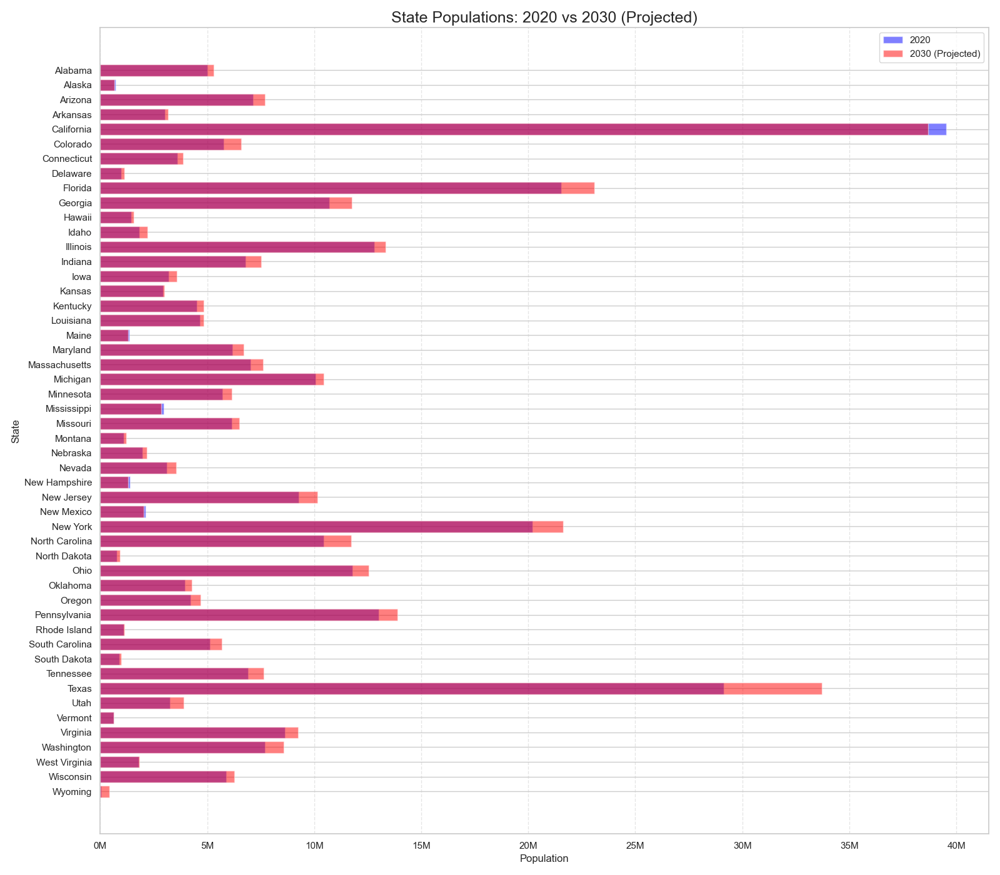

# State Rankings by Feature
This project focuses on the United States of America, and attempts to make predictions based on data for each state, to determine what state would be the best to live in.

## Early Analysis
Initially our data was a empty dataframe made via pandas. Two columns were created:
- State
- Year

## The Populations Missing Years
Next was to add the population into our data to use as the backbone for most of our predictions. This data was stored in "[./data/modified/state_pops.csv](./data/modified/state_pops.csv)". The United States census happens every ten years, so I have made a prediction for each year between 1970 and 2030 for what the population was. Here are the results:

Upon rectifying our missing years, and predicting our future years, they were packaged into our primary dataframe, giving us three columns.
- States
- Year
- Population

## State Feature Data
Now that the State, year and population data was packaged, we needed to import our Features. Column by Column the data was constructed via the constructor functions within "[./func.py](./func.py)", this pulled the rest of the data from 93 files, cleaned and packaged them in the initial dataframe, preparing them for predictions, before saving them to "[./data/compiled_data/states.csv](./data/compiled_data/states.csv)".
- State
- Year
- Population
- CO2 Emissions (Millions of tonnes)
- PPP
- GDP
- Average Salary
- Average Disposable Income
- Violent Crimes Committed
- Unemployment Rate
- Hospital Count
- Traffic Fatalities
- Air Quality Index

## Predictions
Next we began using a Polynomial model for all but two columns:
- Violent Crimes Committed (Needed more inputs then other columns)
- Hospital Count (Not continuous data, a hospital either exists, or it doesnt, cant have 1.53 hospitals)

## Rankings
Once our predictions were made all that was next was to convert all the data into a comparison-enabled format. For example comparing California and Maine by hospitals would be unfair, if we didnt factor in population. So the Hospitals Per Capita and Violent Crimes Per Capita columns were added.

Next a function was created that will take any year in our predicted data, and convert the value in each column with an integer, 1 through 50 relative to where it places, for example, if a State has the best Air quality, it would be 1, and if a State has the worst Air quality it would be 50.

Afterwards we will use Golf rules to determine the winner, the lowest score (the closest to number 1 in each category) will win.