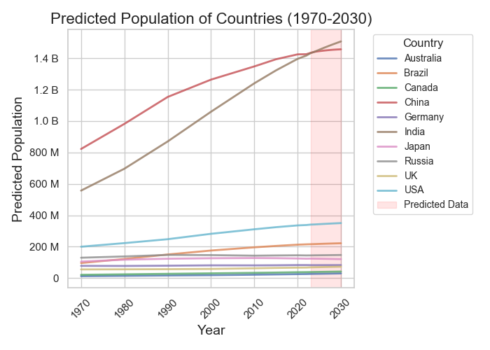
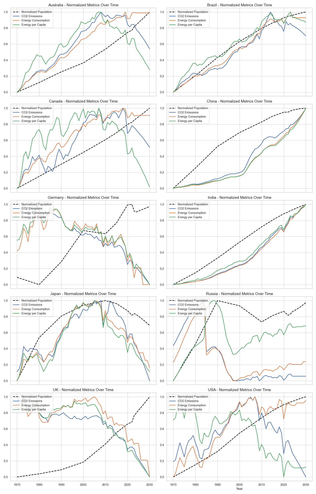

# Energy Consumption vs Water Consumption vs Population
This repository will analyze several datasets and compare them together, to get an idea of what the global energy and water usage trends have been between 1965 and 2023, while considering the populations. After analyzing this data, we will create a series of models and predict future usage per country.

## Early Analysis
Upon receiving the datasets, it was noticed immediately that they had very different countries present. Specifically the Water Dataset had 10 extra countries and the Population Dataset had roughly 224 extra countries. I opted to drop the extra Nations from the data.

## The Populations Missing Years
The United States census happens every ten years, so I have made a prediction for each year between 1970 and 2030 for what the population was. Here are the results:

Upon rectifying our missing years, and predicting our future years, I packaged all the datasets into one larger pool. Now I can begin looking at how our data looks as a whole rather then trying to fit several pieces together.

## Visualizing the Data
Next we will normalize our data and plot it, by type, to see if we can spot any trends up front.

Looking at the normalized data we can directly see that the data is in fact correlated heavily, but not necessarily with the population.

## Our Predictions
Next lets take a look at our predicted Energy consumption for each Nation.

Now we can begin taking a look directly at the United States